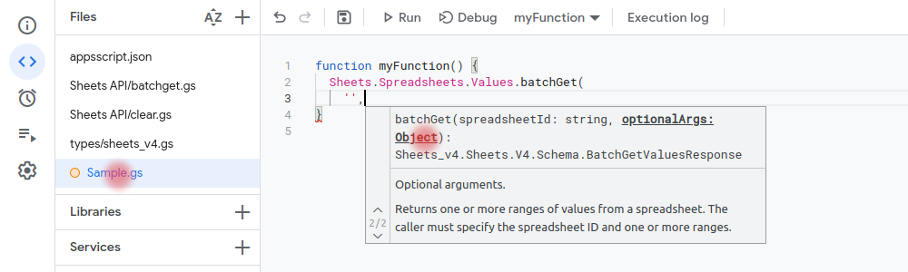

# GASExtra Types

This is a repository if you want to comfortably write code with additional type hints directly in the online Google Apps Script IDE

## How it works

The types directory contains files with additional types. Copy them to your project. Now you can use this.

The problem

The second argument `optionalArg` of `Sheets.Spreadsheets.Values.batchGet(spreadsheetId:strong, optionalArg:Object)` is an Object. It's nod detailed.



Using enums


Using optionalArgs as a defined object


The final code should be something like this

```js
/** @type {string} */
const spreadsheetId = 'ABC123';
/** @type {GASExtra.sheets_v4.enums.MajorDimension} */
const majorDimension = 'ROWS';
/** @type {GASExtra.sheets_v4.Schema.BatchGetValuesRequestOptionalArgs} */
const getOptionalArgs = {
  ranges: ['A:A', 'C:C'],
  majorDimension,
};
const batchGetValuesResponse = Sheets.Spreadsheets.Values.batchGet(spreadsheetId, getOptionalArgs);
```

I find it very convenient. I don't need to look at the documentation all the time to remember the parameters of this object.

## Additional

[DefinitelyTyped/google-apps-script](https://github.com/DefinitelyTyped/DefinitelyTyped/tree/master/types/google-apps-script) still contains the required amount of information. The types proposed here do not overlap with DefinitelyTyped.
