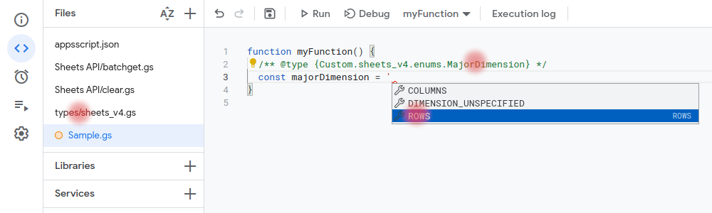

# GASExtra Types

This is a repository if you want to comfortably write code with additional type hints directly in the online Google Apps Script IDE

## How it works

The types directory contains files with additional types. Copy them to your project. Now you can use this.

