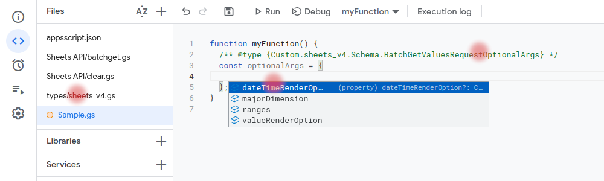

# GASExtra Types

This is a repository if you want to comfortably write code with additional type hints directly in the online Google Apps Script IDE

## How it works

The types directory contains files with additional types. Copy them to your project. Now you can use this.

Using enums

Using optionalArgs as a defined object

## Additional

[DefinitelyTyped/google-apps-script](https://github.com/DefinitelyTyped/DefinitelyTyped/tree/master/types/google-apps-script) still contains the required amount of information. The types proposed here do not overlap with DefinitelyTyped.
